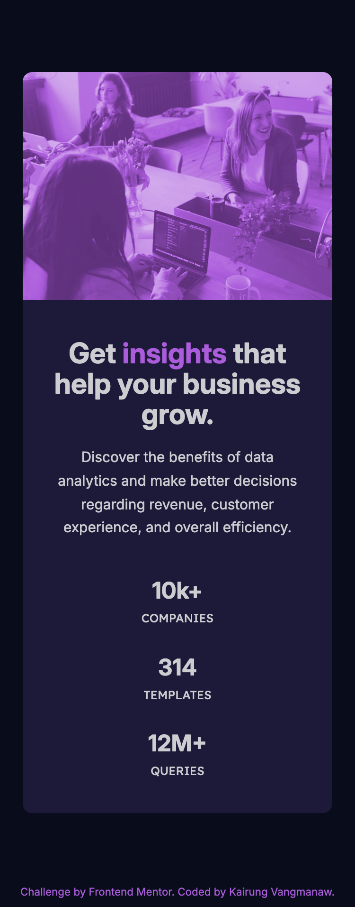
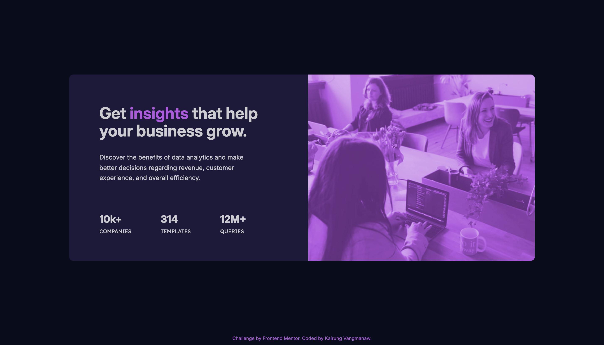

# Frontend Mentor - Stats preview card component solution

This is a solution to the [Stats preview card component challenge on Frontend Mentor](https://www.frontendmentor.io/challenges/stats-preview-card-component-8JqbgoU62). Frontend Mentor challenges help you improve your coding skills by building realistic projects. 

## Table of contents

- [Frontend Mentor - Stats preview card component solution](#frontend-mentor---stats-preview-card-component-solution)
  - [Table of contents](#table-of-contents)
  - [Overview](#overview)
    - [The challenge](#the-challenge)
    - [Screenshot](#screenshot)
    - [Links](#links)
  - [My process](#my-process)
    - [Built with](#built-with)
    - [What I learned](#what-i-learned)
    - [Continued development](#continued-development)
    - [Useful resources](#useful-resources)
    - [AI Collaboration](#ai-collaboration)
  - [Author](#author)
  - [Acknowledgments](#acknowledgments)

## Overview

### The challenge

Users should be able to:

- View the optimal layout depending on their device's screen size

### Screenshot

  
Mobile view

  

  
Desktop view

  

### Links

- Solution URL: [Stats Preview Card with React, Vite & Modern BEM Layout](https://www.frontendmentor.io/solutions/stats-preview-card-using-html-and-css-sass-Ny1Z0Mr1Aa)
- Live Site URL: [Frontend Mentor | Stats preview card component](https://challenged-by-frontend-mentor.github.io/stats-preview-card-component/)

## My process

### Built with

- Semantic HTML5 markup
- CSS Custom Properties
- Flexbox
- BEM Methodology
- [React](https://react.dev/) - JS library for component structure
- [Vite](https://vite.dev/) - Frontend build tool
- Mobile-first workflow

### What I learned

In this challenge, I took a deeper dive into CSS mechanics and layout behavior that I previously overlooked:

- **Flexbox Mechanics & Spacing**: I learned how `flex-grow`, `flex-shrink`, and `flex-basis` calculate free space under the hood, and how to use `margin: auto` inside Flexbox containers for clean vertical alignment without breaking the footer flow.

- **Responsive Image Overlays**: Using the `<picture>` element alongside `mix-blend-mode` and `filter` allowed me to swap art direction efficiently while maintaining exact design colors.

- **Fluid Typography & Spacing**: I practiced using modern CSS functions like `clamp()` to achieve smooth scaling between viewport breakpoints.

### Continued development

For future projects, I plan to keep focusing on:

- Refining my development speed and timing during the initial setup phase.

- Practicing accessibility (a11y) fundamentals, ensuring clean DOM ordering and focus states for keyboard users.

- Exploring subtle micro-interactions and hover effects to make UI components feel more engaging.

### Useful resources

- [MDN - mix-blend-mode](https://developer.mozilla.org/en-US/docs/Web/CSS/Reference/Properties/mix-blend-mode) - Essential for understanding how colors blend between the image and background container.

- [MDN - filter function: sepia](https://developer.mozilla.org/en-US/docs/Web/CSS/Reference/Values/filter-function/sepia) - Helpful reference for image tone adjustments.

- [MDN - The Picture Element](https://developer.mozilla.org/en-US/docs/Web/HTML/Reference/Elements/picture) - Great guide for responsive art-direction switching between mobile and desktop images.

- [MDN - place-content](https://developer.mozilla.org/en-US/docs/Web/CSS/Reference/Properties/place-content) - Quick reference for shorthand layout alignment.

- [MDN - filter](https://developer.mozilla.org/en-US/docs/Web/CSS/Reference/Properties/filter) - Documentation on applying visual effects to elements.

- [Clamp Calculator](https://clampcalculator.com/?vmin=1024&vmax=1440&pmin=40&pmax=72&vu=vw&ou=px) - An indispensable tool for generating clean fluid `clamp()` values across custom viewports.

### AI Collaboration

This project was built with the assistance of Gemini and Google Search AI Mode for technical troubleshooting, code reviews, and refining CSS layout concepts.

## Author

- GitHub: [Kairung Vangmanaw](https://github.com/VangmanawKairung)
- Frontend Mentor - [@VangmanawKairung](https://www.frontendmentor.io/profile/VangmanawKairung)

## Acknowledgments

Big thanks to myself for staying curious and pushing through, my family for their continuous support, the Frontend Mentor team for providing such great challenges, and all the tools that helped make this project successful.

I’d like to give a quick shout-out to macOS Preview! Inspecting specific pixel coordinates directly in Preview made it so much faster to dial in spacing instead of relying purely on trial and error with the design overlay.
